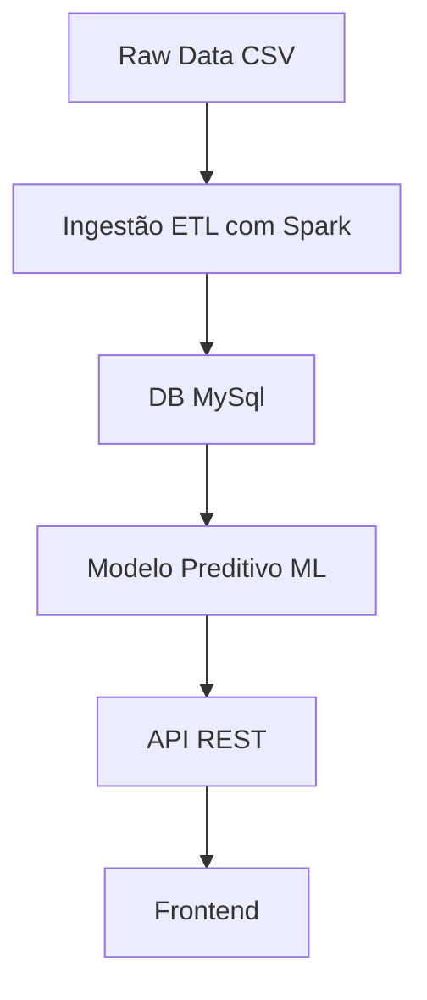

# Proposta de Solução: Plataforma de Análise Preditiva de Rotatividade de Funcionários

## Objetivo

Desenvolver uma plataforma completa que permita prever a probabilidade de um funcionário deixar a empresa (churn/attrition), utilizando aprendizado de máquina, com práticas de ingestão, processamento e visualização de dados em um ecossistema que simule cenários reais de Big Data.

## Arquitetura da Solução




## Componentes

1. Dataset

    Base: [IBM HR Analytics ](https://www.kaggle.com/datasets/pavansubhasht/ibm-hr-analytics-attrition-dataset/data)(dados históricos de funcionários).

    Atributo-alvo: Attrition (Yes/No).

3. Pipeline de Ingestão e Processamento

    Ferramenta: Apache Spark (PySpark)

    Processos:

        Leitura de arquivos .csv ou dados em stream.

        Limpeza e transformação (normalização, codificação de variáveis categóricas).

        Escrita em banco de dados relacional (MySQL).

4. Treinamento do Modelo

    Linguagem: Python

    Libs: scikit-learn (Logistic Regression, Random Forest, XGBoost)

    Pipeline de ML:

        Divisão treino/teste

        Validação cruzada

        Exportação do modelo com joblib ou mlflow

        Métricas: AUC, F1, accuracy

4. API REST

    Funções:

        Endpoint /predict: recebe JSON com dados de funcionários e retorna probabilidade de saída

        Endpoint /employees: CRUD opcional para gerenciamento

        Integração com MySql para armazenar históricos

5. Frontend

    Funcionalidades:

        Exibição da probabilidade de saída

        Filtro por departamento, cargo, etc.

        Integração com API

6. Banco de Dados

    Principal: MySql)
   

Organização dos Repositórios
```bash
/project
├── backend-api/          
├── frontend/             
├── model/                # Notebook + modelo .pkl ou .joblib
├── data_pipeline/        
└── docker-compose.yml    # Infra mínima local
```

Links legais

[Outlier](https://www.kaggle.com/code/nareshbhat/outlier-the-silent-killer)</br>
[Attrition in an Organization](https://www.kaggle.com/code/janiobachmann/attrition-in-an-organization-why-workers-quit/notebook)</br>
[Decision Trees & Random Forest](https://www.kaggle.com/code/faressayah/decision-trees-random-forest-for-beginners)</br>
[Employee attrition via Ensemble tree-based methods](https://www.kaggle.com/code/arthurtok/employee-attrition-via-ensemble-tree-based-methods)</br>
[HR Analytics Prediction](https://www.kaggle.com/code/paramarthasengupta/hr-analytics-prediction-why-do-people-resign)</br>
[Employee Attrition & Performance](https://www.kaggle.com/code/faressayah/ibm-hr-analytics-employee-attrition-performance)</br>
[Attrition Analysis and Prediction](https://www.kaggle.com/code/vincentlugat/ibm-attrition-analysis-and-prediction)</br>
